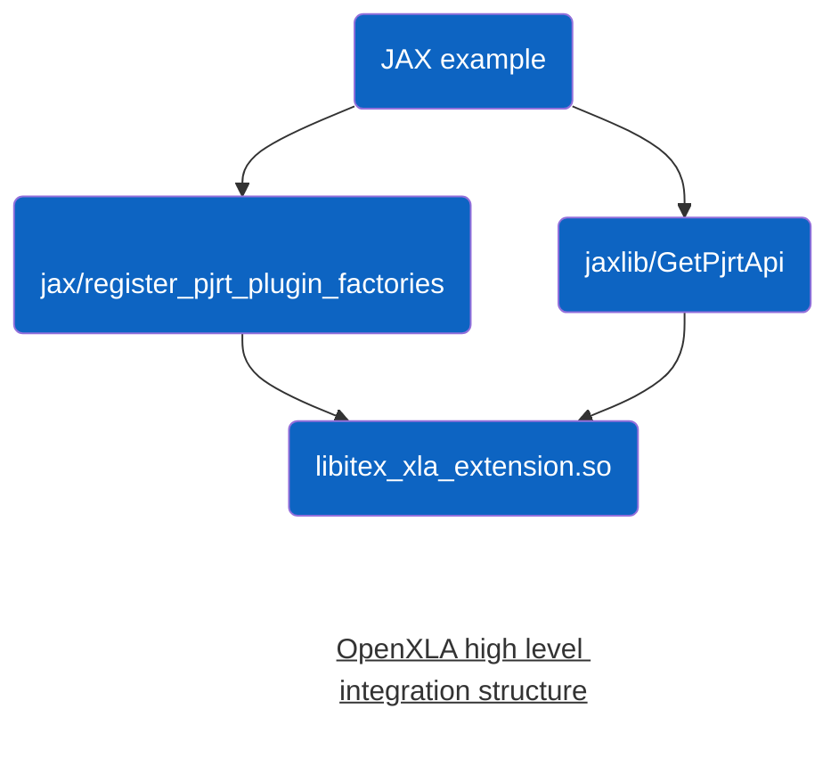

# OpenXLA Support on GPU
This guide introduces the overview of OpenXLA high level integration structure, and demonstrates how to build Intel® Extension for TensorFlow* and run JAX example with OpenXLA.

## 1. Overview
Intel® Extension for TensorFlow* adopts PJRT plugin interface to implement Intel GPU backend for OpenXLA experimental support, and takes JAX front end APIs as example. PJRT is a uniform device API in OpenXLA ecosystem. Refer to [OpenXLA PJRT Plugin RFC](https://github.com/openxla/community/blob/main/rfcs/20230123-pjrt-plugin.md) for more details.


* [JAX](https://jax.readthedocs.io/en/latest/) provides a familiar NumPy-style API, includes composable function transformations for compilation, batching, automatic differentiation, and parallelization, and  the same code executes on multiple backends.
* In JAX python package, [`jax/_src/lib/xla_bridge.py`](https://github.com/google/jax/blob/jaxlib-v0.4.4/jax/_src/lib/xla_bridge.py#L317-L320)
    ```c++
    register_pjrt_plugin_factories(os.getenv('PJRT_NAMES_AND_LIBRARY_PATHS', ''))
    ```
    `register_pjrt_plugin_factories` registers backend for PJRT plugins. For intel XPU  `PJRT_NAMES_AND_LIBRARY_PATHS` is set to be `'xpu:Your_itex_path/bazel-bin/itex/libitex_xla_extension.so'`,  `xpu` is the backend name and `libitex_xla_extension.so` is the PJRT plugin library.
* In jaxlib python package `jaxlib/xla_extension.so`,    
   Jaxlib gets the lastest tensorflow code which calls the [PJRT C API interface](https://github.com/tensorflow/tensorflow/blob/master/tensorflow/compiler/xla/pjrt/c/pjrt_c_api.h). The backend needs to implement these API.
*  `libitex_xla_extension.so` implements `PJRT C API inferface` which can be got in [GetPjrtApi](https://github.com/tensorflow/tensorflow/blob/master/tensorflow/compiler/xla/pjrt/pjrt_api.cc#L82).

## 2. Build Library for JAX
There are some differences from   [source build procedure](https://github.com/intel/intel-extension-for-tensorflow/blob/main/docs/install/how_to_build.md)
* Make sure get Intel® Extension for TensorFlow* main branch code and python version >=3.8.
* In TensorFlow installation steps, make sure to install jax and jaxlib at the same time.
   ```bash
    $ pip install tensorflow==2.12.0 jax==0.4.4 jaxlib==0.4.4
   ```
* In "Configure the build" step, run ./configure, select yes for JAX support,

    >=> "Do you wish to build for JAX support? [y/N]: Y"
* Build command:
    ```bash
    $ bazel build --config=jax -c opt //itex:libitex_xla_extension.so
    ```
Then we can get the library with xla extension   **./bazel-bin/itex/libitex_xla_extension.so**

## 3. Run JAX Example
* **Set library path.**
```bash
$ export PJRT_NAMES_AND_LIBRARY_PATHS='xpu:Your_itex_path/bazel-bin/itex/libitex_xla_extension.so'
$ export LD_LIBRARY_PATH=$LD_LIBRARY_PATH:Your_Python_site-packages/jaxlib # Some functions defined in xla_extension.so are needed by libitex_xla_extension.so

$ export ONEDNN_VERBOSE=1 # Optional variable setting. Enable onednn verbose to check if it runs on GPU.
```
* **Run the below jax python code.**
```python
import jax.numpy as jnp
from jax import random
key = random.PRNGKey(0)
size = 3000
x = random.normal(key, (size, size), dtype=jnp.float32)
y = jnp.dot(x, x.T).block_until_ready()
print(y)
```
* **Reference result:**
```
onednn_verbose,info,oneDNN v3.1.0 (commit xxxx)
onednn_verbose,info,cpu,runtime:DPC++,nthr:1
onednn_verbose,info,cpu,isa:Intel 64
onednn_verbose,info,gpu,runtime:DPC++
onednn_verbose,info,cpu,engine,0,backend:OpenCL,name:Intel(R) Xeon(R) Gold 6346 CPU @ 3.10GHz,driver_version:2022.15.12,binary_kernels:disabled
onednn_verbose,info,gpu,engine,0,backend:Level Zero,name:Intel(R) Data Center GPU Flex Series 170 [0x56c0],driver_version:1.3.25018,binary_kernels:enabled
onednn_verbose,info,gpu,engine,1,backend:Level Zero,name:Intel(R) Data Center GPU Flex Series 170 [0x56c0],driver_version:1.3.25018,binary_kernels:enabled
onednn_verbose,info,experimental features are enabled
onednn_verbose,info,use batch_normalization stats one pass is enabled
onednn_verbose,info,experimental functionality for sparse domain is enabled
onednn_verbose,info,prim_template:operation,engine,primitive,implementation,prop_kind,memory_descriptors,attributes,auxiliary,problem_desc,exec_time
onednn_verbose,exec,gpu:0,matmul,jit:gemm:any,undef,src_f32::blocked:abc:f0 wei_f32::blocked:abc:f0 dst_f32::blocked:abc:f0,attr-scratchpad:user ,,1x3000x3000:1x3000x3000:1x3000x3000,xxxxxxxx
[[2938.1716   17.388428  36.508217  ...   32.315964  51.31904    -34.432026]
 [17.388428   3031.179   41.194576  ...   47.248768  58.077858   -13.371612]
 [36.508217   41.194576  3000.4697  ...   8.10901    -42.501842  26.495111]
 ...
 [32.315964   47.248768  8.10901    ...   2916.339   34.38107    39.404522]
 [51.31904    58.077858  -42.501842 ...   34.38107   3032.2844   63.69183 ]
 [-34.432026  -13.371612 26.495111  ...   39.404522  63.69183    3033.4866  ]]
```
Check it runs on GPU but not CPU. For example, "onednn_verbose,exec,**gpu**:0,matmul, ..." means "matmul" runs on GPU.

**4. More JAX examples.**    
Get examples from [https://github.com/google/jax](https://github.com/google/jax/tree/jaxlib-v0.4.4/examples) to run.
```bash
$ git clone https://github.com/google/jax.git
$ cd jax && git checkout jax-v0.4.4
$ export PJRT_NAMES_AND_LIBRARY_PATHS='xpu:Your_itex_path/bazel-bin/itex/libitex_xla_extension.so'
$ python -m examples.mnist_classifier
```
