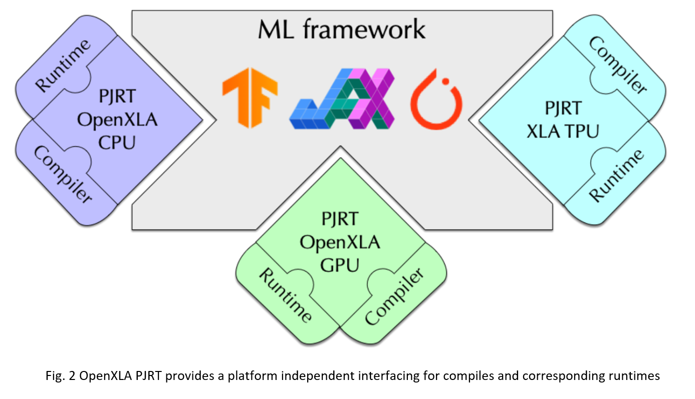
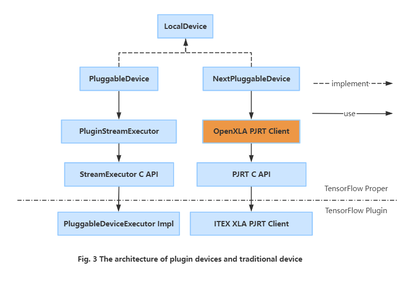

# NextPluggableDevice Overview

The NextPluggableDevice (NPD) represents an advanced generation of [PluggableDevice](https://github.com/tensorflow/community/blob/master/rfcs/20200624-pluggable-device-for-tensorflow.md) mechanism. It not only facilitates a seamless integration of new accelerator plugins for registering devices with TensorFlow without requiring modifications to the TensorFlow codebase, but it also serves as a conduit to [OpenXLA (Accelerated Linear Algebra)](https://github.com/openxla/xla) via its [PJRT plugin](https://github.com/openxla/community/blob/main/rfcs/20230123-pjrt-plugin.md).

- [Overview](#NextPluggableDevice-Overview)

- [Why NextPluggableDevice](#Why-NextPluggableDevice)

- [Starting With NextPluggableDevice](#How-to-start-with-XLA-using-NextPluggableDevice)

- [Architecture](#NextPluggableDevice-Architecture)

- [Runtime Switch](#Runtime-Switch-of-NextPluggableDevice-and-PluggableDevice)

## Why NextPluggableDevice

Previously, Stock TensorFlow has designed & developed the [PluggableDevice](https://github.com/tensorflow/community/blob/master/rfcs/20200624-pluggable-device-for-tensorflow.md) to extend new device extensions without making device-specific changes to the TensorFlow code, and the PluggableDevice is tightly integrated with the [StreamExecutor C API](https://github.com/tensorflow/community/pull/257) today.

However, excessive binding with StreamExecutor has made it difficult for the PluggableDevice to be compatible 
with [OpenXLA](https://github.com/openxla/xla). Precisely for this reason, TensorFlow evolved to use [PJRT plugin](https://github.com/openxla/community/blob/main/rfcs/20230123-pjrt-plugin.md) as the device API, resulting in the decoupling of the Pluggable Device from StreamExecutor, implemented as NextPluggableDevice.

## Start with XLA using NextPluggableDevice

Enabling XLA in ITEX is exactly the same as it is in TensorFlow, except that you need to export environment variables first:
```
$ export TF_XLA_FLAGS="--tf_xla_use_device_api=true  --tf_xla_auto_jit=2"
$ python
>>> import tensorflow as tf  # TensorFlow registers NextPluggableDevice here
>>> @tf.function(experimental_compile=True)
... def add_with_xla(a, b):
...     return a + b
>>> a = tf.constant([1.0, 2.0, 3.0])
>>> b = tf.constant([4.0, 5.0, 6.0])
>>> result = add_with_xla(a, b)
>>> print("Result: ", result)
Result:  tf.Tensor([5. 7. 9.], shape=(3,), dtype=float32)
```

## NextPluggableDevice Architecture

The NextPluggableDevice represents an advanced generation of the [PluggableDevice](https://github.com/tensorflow/community/blob/master/rfcs/20200624-pluggable-device-for-tensorflow.md) mechanism. Intel® Extension for TensorFlow* integrates the NextPluggableDevice as a new device type, along with the corresponding [PJRT CAPI](https://github.com/tensorflow/tensorflow/blob/master/third_party/xla/xla/pjrt/c/pjrt_c_api.h) for registering its Ops & Kernels, XLA PJRT client, Runtime, as well as the legacy Graph Optimization API and Profiler interface. In this way, it not only facilitates a seamless integration of new accelerator plugins for registering devices with TensorFlow without requiring modifications to the TensorFlow codebase, but it also serves as a conduit to [OpenXLA](https://github.com/openxla/xla) via its [PJRT plugin](https://github.com/openxla/community/blob/main/rfcs/20230123-pjrt-plugin.md).
<p align="center">
  
</p>

### OpenXLA PJRT Plugin

[PJRT](https://github.com/tensorflow/tensorflow/blob/master/third_party/xla/xla/pjrt/c/pjrt_c_api.h) is a uniform Device API in the OpenXLA ecosystem. The long term vision for PJRT is that: (1) frameworks (TensorFlow, PyTorch, JAX, etc.) will call PJRT, which has device-specific implementations that are opaque to the frameworks; (2) each device focuses on implementing PJRT APIs, and can remain opaque to the frameworks.
<p align="center">
  
</p>


the PJRT API will provide an easy interface with which frameworks can integrate a packaged compiler and runtime solution. It will be the supported interface used by TensorFlow and JAX for all compiler and runtime integration. And as such it will be easy for other compilers and runtimes that implement the PJRT interface to integrate with these systems.

## Runtime Switch of NextPluggableDevice and PluggableDevice
Intel® Extension for TensorFlow* is fully integrated with both PluggableDevice and NextPluggableDevice, and provides a runtime switch mechanism for enhancing both efficiency and flexibility. Figure 3 presents the architectures of the PluggableDevice and NextPluggableDevice.

<p align="center">
  
</p>

Intel® Extension for TensorFlow* offers environmental variables to enable and disable different devices. Simply export the variables listed in the table below within your runtime environment to selectively enable or disable the corresponding device.
|Environment Variable|NextPluggableDevice|PluggableDevice|
|:-|:-:|:-:|
|export ITEX_ENABLE_NEXTPLUGGABLE_DEVICE=1| enabled | disabled |
|export ITEX_ENABLE_NEXTPLUGGABLE_DEVICE=0| disabled | enabled |
|export TF_XLA_FLAGS="--tf_xla_use_device_api=true  --tf_xla_auto_jit=2"| enabled | disabled |
|default| enabled | disabled |

### Check Currently Used Device Type
In order to easily distinguish the currently used device type, users can check the verbose output as below:
```
# Using NextPluggableDevice
tensorflow/core/common_runtime/next_pluggable_device/next_pluggable_device_factory.cc:118] Created 1 TensorFlow NextPluggableDevices. Physical device type: XPU

# Using PluggableDevice
tensorflow/core/common_runtime/pluggable_device/pluggable_device_factory.cc:272] Created TensorFlow device -> physical PluggableDevice (device: 0, name: XPU, pci bus id: <undefined>)
```

